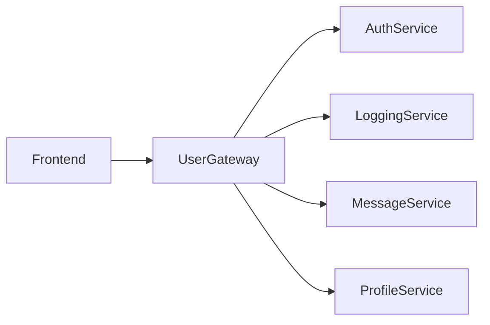

# Kwetter Microservices

Backend microservices of my Kwetter project, a twitter clone created for a college assignment

## Technologies used
- Java
- Spring Boot
- gRPC to facilitate communication between microservices and the gateway
- Kafka to facilitate communication between microservices
- GitLab CI/CD to automatically test/build/deploy to docker

## Architecture overview

